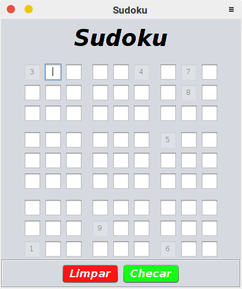
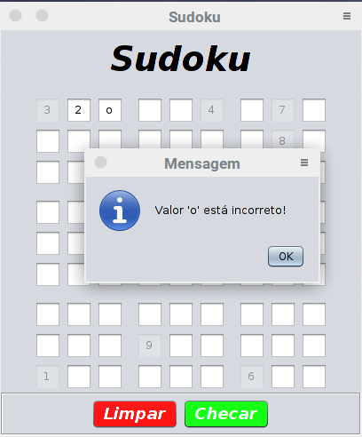

# Sudoku em java

## Como foi feito

<p>Na elaboração do projeto utilizei o editor de textos sublime text3, apenas por escolha pessoal, e para criação da interface gráfica utilizei a biblioteca, swing do Java.</p>
<p>Esse projeto além de exigir um conhecimento das biblioteca Java também me exigiu lógica, para que o jogo funcionasse de acordo, e uma melhor organização no que tange a organização do meu projeto, como pacotes, nome de classes, entre outros.</p>

## Como compilar

<p>O  jeito que fiz no meu computador foi utilizando o terminal, na pasta do projeto, com o seguinte comando:</p>

``` bash
$ javac -classpath bin/  -d bin   src/br/com/william/sudoku/gui/*.java src/br/com/william/sudoku/test/*.java src/br/com/william/sudoku/controller/*.java src/br/com/william/sudoku/logica/*.java src/br/com/william/sudoku/*.java src/br/com/william/sudoku/validador/*.java 

```

<p>Dessa maneira ele compila e joga os arquivos *.class na pasta bin!</p>

## Como executar

<p>Nada te impede de criar um projeto, em uma IDE, e colar a pasta "br/", mas se quiser utilizar o terminal :  </p>

```bash
java -cp bin/ br.com.william.sudoku.Main
```

<p>Onde "bin/" possui as classes do projeto !!!</p>

## Imagens

        
